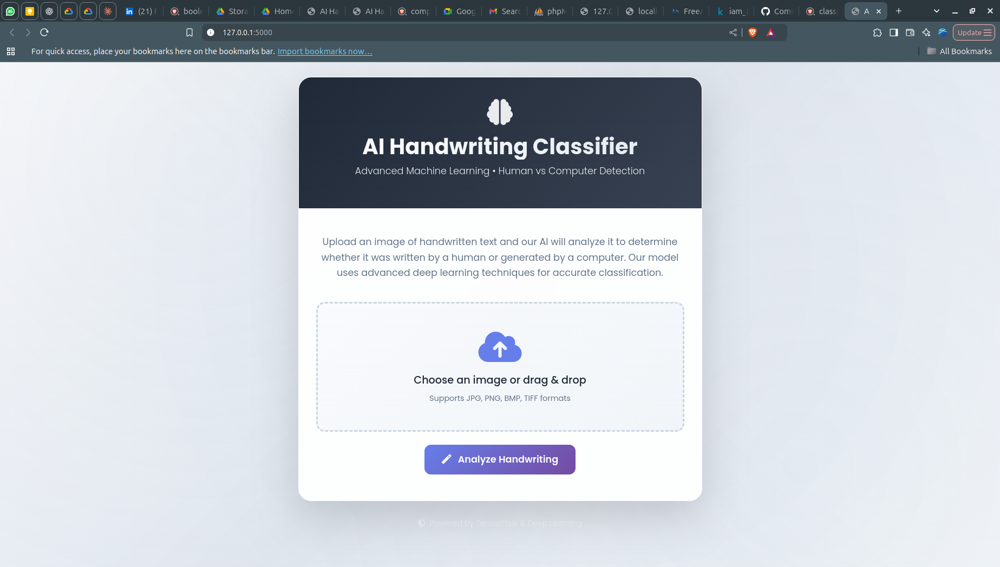

# Handwriting Classification (Human vs. Computer-Generated)

This project is a web application that uses a Convolutional Neural Network (CNN) to classify an image of a word as either human-written or computer-generated. The model is trained on a dataset of handwritten words and a custom-generated dataset of words rendered with various fonts.

## About This Project

This is an updated version of a handwriting classification project I worked on during college. I've since revisited and improved it with better techniques I've learned over time.

### What's Been Improved:
- Better performance with mixed precision training
- Cleaner code structure and error handling  
- Modern web interface with file upload
- More efficient data processing
- Added proper logging and monitoring
- Simplified model architecture that works reliably

The original project taught me the basics of machine learning, and this version reflects what I've learned since then about building more practical ML applications.

## Features

-   Generates a dataset of computer-written text images using various fonts.
-   Preprocesses both human and computer-written image data.
-   Builds and trains a CNN model using TensorFlow and Keras.
-   Provides a simple web interface using Flask to upload an image and get a prediction.

## Project Structure

```
.
├── app.py                                  # Main Flask application file
├── Human Vs Computer Handwriting...ipynb   # Jupyter Notebook for data prep and model training
├── Word_Prediction.keras                   # The trained model (excluded from git - see setup notes)
├── requirements.txt                        # Required Python packages
├── README.md                               # This file
├── FONTS/                                  # Directory for font files (.ttf, .otf)
├── hand_words/                             # Human handwriting dataset (excluded from git)
├── comp_words/                             # Computer-generated dataset (excluded from git)
├── data_split/                             # Preprocessed datasets (excluded from git)
├── templates/
│   └── index.html                          # HTML template for the web app
├── uploads/                                # Runtime folder for uploaded images (excluded from git)
└── screenshot/                             # Example screenshots for documentation
```

## Setup and Installation

1.  **Prerequisites**: Ensure you have Python 3.8+ installed on your system.

2.  **Clone the Repository**: 
    ```bash
    git clone <repository-url>
    cd Handwriting-Classification-Human_Vs-Computer-Generated-main
    ```

3.  **Install Dependencies**: Install the required packages using the `requirements.txt` file.
    ```bash
    pip install -r requirements.txt
    ```

4.  **Setup Required Directories**: The following directories are excluded from git and need to be created/populated:
    ```bash
    mkdir -p uploads hand_words comp_words data_split
    ```

5.  **Model Files**: 
    - The trained model files (`*.keras`) are **excluded from git** due to GitHub's 100MB file size limit
    - **You must train the model yourself** using the Jupyter notebook (see "Retraining the Model" section below)

6.  **Dataset Setup**:
    - The datasets (`hand_words/`, `comp_words/`, `data_split/`) are excluded from git to keep repository size manageable
    - The notebook can generate synthetic computer text data using the included fonts
    - **For human handwriting data**: Download the IAM Handwriting Word Database from Kaggle:
      - Dataset URL: https://www.kaggle.com/datasets/nibinv23/iam-handwriting-word-database/data
      - Extract to `hand_words/` directory in the project root
      - You'll need a Kaggle account to download the dataset


## Usage

There are two main parts to this project: retraining the model and running the prediction web application.

### 1. Running the Web Application

To start the web server and use the pre-trained model for predictions:

1.  Open your terminal in the project directory.

2.  Set the Flask application environment variable. 
    
    On Windows:
    ```cmd
    set FLASK_APP=app.py
    ```
    On macOS/Linux:
    ```bash
    export FLASK_APP=app.py
    ```

3.  Run the Flask application.
    ```bash
    flask run
    ```

4.  Open your web browser and navigate to `http://127.0.0.1:5000`.

5.  Upload an image of a word to classify it.

### 2. Retraining the Model

If you want to modify the model or retrain it on new data, use the Jupyter Notebook:

1.  Make sure you have Jupyter Notebook installed (`pip install notebook`).
2.  Run Jupyter Notebook from your terminal:
    ```bash
    jupyter notebook
    ```
3.  Open the `Human Vs Computer Handwriting Classification Project Final Khushboo.ipynb` file.
4.  You can run the cells sequentially to perform the following steps:
    -   Generate computer-written text images.
    -   Preprocess all image data.
    -   Split the data into training, validation, and test sets.
    -   Build and compile the CNN model.
    -   Train the model and save the new `Word_Prediction.keras` file.

## Technologies Used

-   **Backend**: Python, Flask
-   **Machine Learning**: TensorFlow, Keras, Scikit-learn
-   **Data Processing**: NumPy, Pillow (PIL), OpenCV, Scikit-image
-   **Data Visualization**: Matplotlib, Seaborn

## Screenshots

### Web App Page



